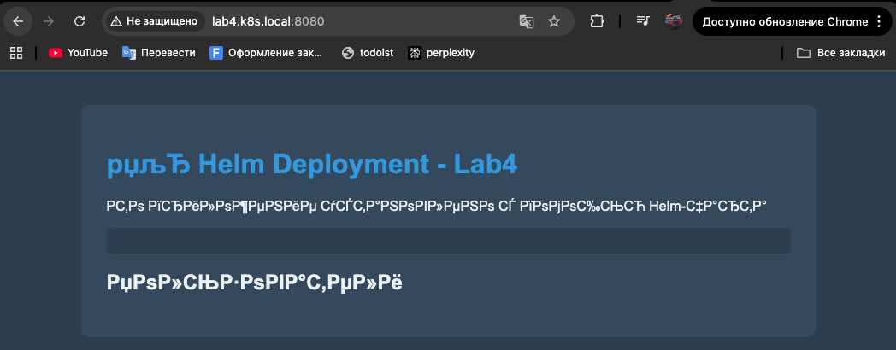
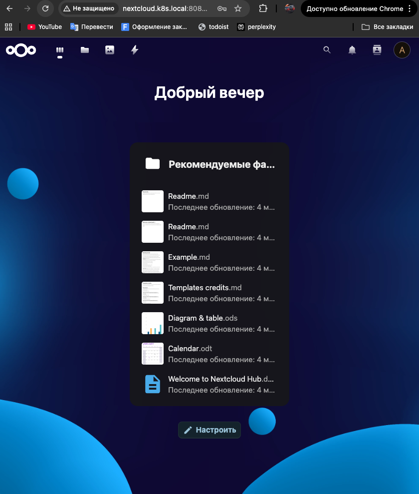

# Отчет по практической работе №4
## Студент: [ФИО]
## Группа: [номер группы]
## Дата выполнения: [дата]
### 1. Настройка хранилища
#### 1.1 Выбранный вариант хранилища
Укажите, какой вариант вы выбрали: Local Path Provisioner
#### 1.2 StorageClass
```
root@k8s-master:~# kubectl get storageclass
NAME                   PROVISIONER             RECLAIMPOLICY   VOLUMEBINDINGMODE      ALLOWVOLUMEEXPANSION   AGE
local-path (default)   rancher.io/local-path   Delete          WaitForFirstConsumer   false                  3d2h
```
#### 1.3 Тестовый PVC
```
root@k8s-master:~# kubectl get pvc
NAME       STATUS   VOLUME                                     CAPACITY   ACCESS MODES   STORAGECLASS   AGE
test-pvc   Bound    pvc-3dcc633b-f41a-4907-8e14-a79ac39a0540   1Gi        RWO            local-path     33m
```
### 2. Установка Helm
#### 2.1 Версия Helm
```
root@k8s-master:~# helm version
version.BuildInfo{Version:"v3.13.2", GitCommit:"2a2fb3b98829f1e0be6fb18af2f6599e0f4e8243", GitTreeState:"clean", GoVersion:"go1.20.10"}
```
#### 2.2 Репозитории
```
root@k8s-master:~# helm repo list
NAME   	URL
stable 	https://charts.helm.sh/stable
bitnami	https://charts.bitnami.com/bitnami
```
### 3. Создание собственного Helm-чарта
#### 3.1 Структура чарта
```
root@k8s-master:~/helm-charts# tree lab4-app/
lab4-app/
├── Chart.yaml
├── templates
│   ├── goapp-deployment.yaml
│   ├── goapp-service.yaml
│   ├── _helpers.tpl
│   ├── ingress.yaml
│   ├── nginx-configmap.yaml
│   ├── nginx-deployment.yaml
│   ├── nginx-service.yaml
│   ├── NOTES.txt
│   ├── postgres-configmap.yaml
│   ├── postgres-deployment.yaml
│   ├── postgres-pvc.yaml
│   └── postgres-service.yaml
└── values.yaml

2 directories, 14 files
```
#### 3.2 Установка чарта
```
root@k8s-master:~/helm-charts# helm list -n lab4-app
NAME        	NAMESPACE	REVISION	UPDATED                                	STATUS  	CHART         	APP VERSION
lab4-release	lab4-app 	4       	2026-04-01 17:47:08.986549606 +0300 MSK	deployed	lab4-app-0.1.0	1.0.0
```
#### 3.3 Сгенерированные ресурсы
```
root@k8s-master:~/helm-charts# kubectl get all -n lab4-app
NAME                                         READY   STATUS    RESTARTS   AGE
pod/lab4-release-goapp-6b8c655547-54j9x      1/1     Running   0          148m
pod/lab4-release-goapp-6b8c655547-8st9d      1/1     Running   0          148m
pod/lab4-release-goapp-6b8c655547-9gqwk      1/1     Running   0          148m
pod/lab4-release-goapp-6b8c655547-ppllc      1/1     Running   0          148m
pod/lab4-release-goapp-6b8c655547-t9vp5      1/1     Running   0          148m
pod/lab4-release-nginx-54bc6b4f69-58fqs      1/1     Running   0          163m
pod/lab4-release-nginx-54bc6b4f69-md74j      1/1     Running   0          156m
pod/lab4-release-nginx-54bc6b4f69-w7glf      1/1     Running   0          163m
pod/lab4-release-postgres-675879d999-2vfhp   1/1     Running   0          163m

NAME                            TYPE        CLUSTER-IP       EXTERNAL-IP   PORT(S)    AGE
service/lab4-release-goapp      ClusterIP   10.109.206.224   <none>        8081/TCP   163m
service/lab4-release-nginx      ClusterIP   10.102.63.143    <none>        8090/TCP   163m
service/lab4-release-postgres   ClusterIP   10.111.96.120    <none>        5432/TCP   163m

NAME                                    READY   UP-TO-DATE   AVAILABLE   AGE
deployment.apps/lab4-release-goapp      5/5     5            5           163m
deployment.apps/lab4-release-nginx      3/3     3            3           163m
deployment.apps/lab4-release-postgres   1/1     1            1           163m

NAME                                               DESIRED   CURRENT   READY   AGE
replicaset.apps/lab4-release-goapp-55978fdbc5      0         0         0       163m
replicaset.apps/lab4-release-goapp-6b8c655547      5         5         5       148m
replicaset.apps/lab4-release-nginx-54bc6b4f69      3         3         3       163m
replicaset.apps/lab4-release-postgres-675879d999   1         1         1       163m
```
### 4. PersistentVolumes
#### 4.1 PV и PVC
```
root@k8s-master:~/helm-charts# kubectl get pv,pvc --all-namespaces
NAME                                                        CAPACITY   ACCESS MODES   RECLAIM POLICY   STATUS   CLAIM                                STORAGECLASS   REASON   AGE
persistentvolume/pvc-3dcc633b-f41a-4907-8e14-a79ac39a0540   1Gi        RWO            Delete           Bound    default/test-pvc                     local-path              5h41m
persistentvolume/pvc-4bcbd4d7-0971-4fa9-acac-2e5040dba54b   5Gi        RWO            Delete           Bound    lab3-app/postgres-pvc                local-path              3d7h
persistentvolume/pvc-7ce73b29-8085-4ae4-a45b-1e9be5e9d3d0   5Gi        RWO            Delete           Bound    lab4-app/lab4-release-postgres-pvc   local-path              163m

NAMESPACE   NAME                                              STATUS   VOLUME                                     CAPACITY   ACCESS MODES   STORAGECLASS   AGE
default     persistentvolumeclaim/test-pvc                    Bound    pvc-3dcc633b-f41a-4907-8e14-a79ac39a0540   1Gi        RWO            local-path     5h41m
lab3-app    persistentvolumeclaim/postgres-pvc                Bound    pvc-4bcbd4d7-0971-4fa9-acac-2e5040dba54b   5Gi        RWO            local-path     3d7h
lab4-app    persistentvolumeclaim/lab4-release-postgres-pvc   Bound    pvc-7ce73b29-8085-4ae4-a45b-1e9be5e9d3d0   5Gi        RWO            local-path     163m
```
#### 4.2 Тест сохранности данных
\`\`\`
[вставьте запросы к API и результат после перезапуска пода]
\`\`\`
### 5. Управление релизами
#### 5.1 История обновлений
```
root@k8s-master:~/helm-charts# helm history lab4-release -n lab4-app
REVISION	UPDATED                 	STATUS    	CHART         	APP VERSION	DESCRIPTION
1       	Wed Apr  1 17:32:07 2026	superseded	lab4-app-0.1.0	1.0.0      	Install complete
2       	Wed Apr  1 17:38:44 2026	superseded	lab4-app-0.1.0	1.0.0      	Upgrade complete
3       	Wed Apr  1 17:39:35 2026	superseded	lab4-app-0.1.0	1.0.0      	Upgrade complete
4       	Wed Apr  1 17:47:08 2026	superseded	lab4-app-0.1.0	1.0.0      	Upgrade complete
5       	Wed Apr  1 20:18:30 2026	failed    	lab4-app-0.1.0	1.0.0      	Upgrade "lab4-release" failed: cannot patch "lab4-release-postgres-pvc" with kind PersistentVolumeClaim: persistentvolumeclaims "lab4-release-postgres-pvc" is forbidden: only dynamically provisioned pvc can be resized and the storageclass that provisions the pvc must support resize
6       	Wed Apr  1 20:20:23 2026	deployed  	lab4-app-0.1.0	1.0.0      	Upgrade complete
```
#### 5.2 Результат отката

### 6. Установка сложного приложения (опционально)
#### 6.1 Установка Nextcloud
\`\`\`
[вставьте вывод helm list -n nextcloud]
\`\`\`
#### 6.2 Скриншот Nextcloud


### 8. Ответы на контрольные вопросы

1. **В чем разница между emptyDir, hostPath и PersistentVolume?**  
   **emptyDir** — том, который создаётся для пода на узле; при удалении пода данные обычно теряются; в чарте `lab4-app` он используется как запасной вариант, когда в `values.yaml` отключена персистентность PostgreSQL (`postgresql.persistence.enabled: false`), см. `templates/postgres-deployment.yaml` (ветка `emptyDir: {}` вместо `persistentVolumeClaim`).  
   **hostPath** — примонтированный каталог с диска конкретного узла; данные привязаны к узлу, перенос пода на другой узел без копирования данных невозможен, в продакшене применяют осторожно.  
   **PersistentVolume (PV)** — ресурс кластера, описывающий реальное хранилище; приложение обычно запрашивает его через **PersistentVolumeClaim (PVC)**. В отчёте для PostgreSQL в namespace `lab4-app` создан PVC `lab4-release-postgres-pvc` на **5Gi** с **StorageClass `local-path`**, том привязан к заявке (см. раздел 4.1).

2. **Как работает динамическое предоставление томов (dynamic provisioning)?**  
   Пользователь создаёт только **PVC** с указанием `storageClassName` и размера. **Provisioner**, связанный с этой StorageClass (в отчёте — `rancher.io/local-path` для класса `local-path`), автоматически создаёт **PV**, привязывает его к PVC и подготавливает том. В выводе `kubectl get storageclass` у `local-path` указан режим **`WaitForFirstConsumer`**: PV создаётся и привязывается ближе к моменту, когда под, использующий PVC, уже можно запланировать на узел.

3. **Что такое StorageClass и зачем он нужен?**  
   **StorageClass** — именованный профиль хранения: какой provisioner создаёт тома, политика reclaim, режим привязки, поддержка расширения и т.д. В практике он позволяет в `values.yaml` чарта задать, например, `postgresql.persistence.storageClass: "local-path"` и не описывать вручную каждый PV. Попытка изменить размер PVC без поддержки расширения в StorageClass в истории Helm (ревизия 5) завершилась ошибкой — это тоже про ограничения, заданные классом и политикой кластера.

4. **Какие преимущества дает Helm по сравнению с набором YAML-файлов?**  
   Один чарта `lab4-app` с **`values.yaml`** задаёт образы, реплики, ресурсы, включение Ingress и параметры БД без дублирования; шаблоны в `templates/` переиспользуют общие метки из `_helpers.tpl`. Команды **`helm install` / `helm upgrade` / `helm history` / откат** дают версионируемые релизы (в отчёте — несколько ревизий `lab4-release`). Удобно менять окружения через разные values-файлы вместо правки десятков статичных манифестов.

5. **Как Helm управляет зависимостями между компонентами?**  
   В собственном чарте зависимости задаются логикой шаблонов и значений: например, Go-приложение получает имя хоста БД как сервис `{{ .Release.Name }}-postgres`, а Nginx в ConfigMap обращается к `{{ .Release.Name }}-goapp` и порту из `goapp.service.port` — порядок установки одного релиза обеспечивается Kubernetes (Deployment/Service), а связи — именами и DNS внутри namespace. Зависимости **subchart’ов** описываются в `Chart.yaml` (`dependencies`); в лабораторном `lab4-app` все компоненты собраны в одном чарте без отдельного subchart для PostgreSQL.

6. **Что происходит с данными при миграции пода на другой узел в разных типах хранилищ?**  
   **emptyDir** — том узла; при перезапуске пода на **другом** узле данные не переезжают (новый пустой том). **hostPath** — данные остаются на исходном узле; под на другом узле их не увидит без общего сетевого/кластерного хранилища. **PVC + PV на общем или сетевом сторедже** (или локальный том с осознанным переносом) — данные привязаны к PV, а не к узлу; под может стартовать на другом узле, если том доступен с него (для `local-path` том физически на конкретном узле — перенос пода на другой узел без пересоздания данных обычно невозможен, что важно для понимания отказоустойчивости).

### 9. Выводы

В ходе работы закрепились базовые понятия **StorageClass**, **динамического провижининга** и связки **PVC/PV** на примере **Local Path Provisioner** и тестового PVC, а также реального тома для PostgreSQL в релизе `lab4-release` в namespace `lab4-app`. Стало наглядно, как в Helm-чарте переключается модель хранения для БД: в шаблоне PostgreSQL при отключённой персистентности используется **emptyDir**, при включённой — **PVC**, что напрямую влияет на сохранность данных при пересоздании пода.

Создание собственного чарта `lab4-app` показало практическую пользу **шаблонов**, **values** и общих **helpers** при сборке нескольких сервисов (PostgreSQL, Go-приложение, Nginx, Ingress). Трудности возникали при согласовании портов, сетевого доступа (Service/Ingress) и при операциях с PVC — в **истории Helm** зафиксирована неудачная попытка изменения PVC без поддержки resize в StorageClass, что хорошо иллюстрирует ограничения инфраструктуры хранения.

Понимание управления приложениями в Kubernetes сместилось от «набора разрозненных YAML» к **релизо-ориентированной** модели: одна точка входа (Helm), повторяемые установки и откаты, параметризация под окружение без копирования манифестов.