# Отчет по практической работе №1

## Студент: Альзоаби Адель Фаридович
## Группа: БСБО-16-23
## Дата выполнения: 11.03.26

### 1. Выполненные команды Docker

#### 1.1 Работа с образами

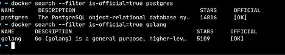  
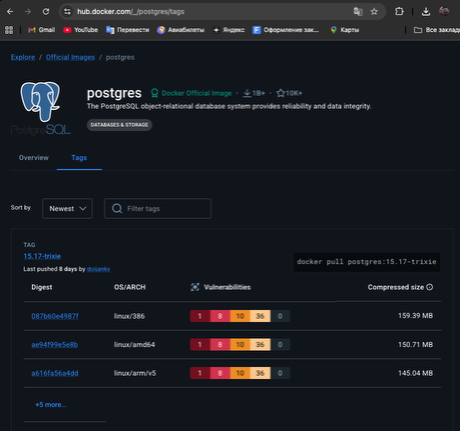  
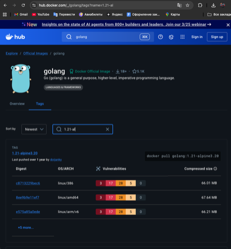  
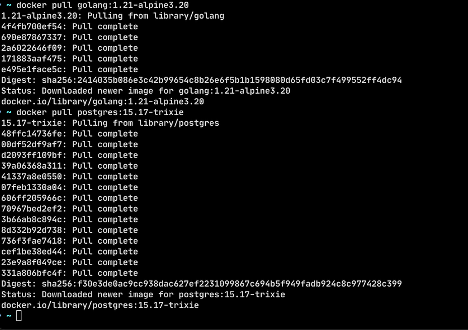  

#### 1.2 Работа с контейнерами

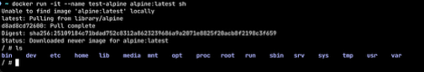  
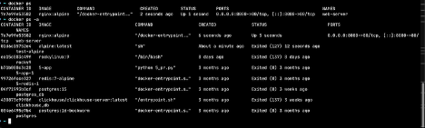  
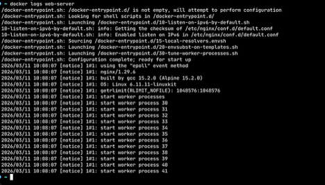  
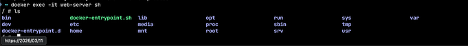  
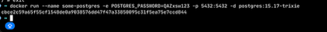  
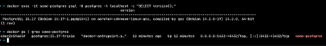  

#### 1.3 Работа с томами

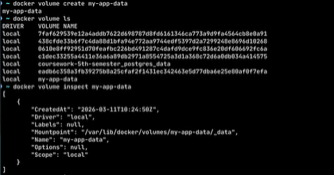  
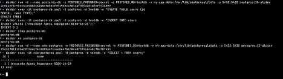  
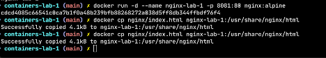  
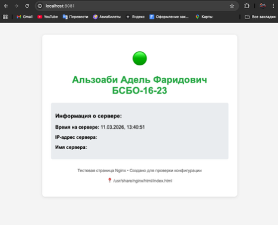  

### 2. Скриншоты работающего приложения

#### 2.1 Главная страница

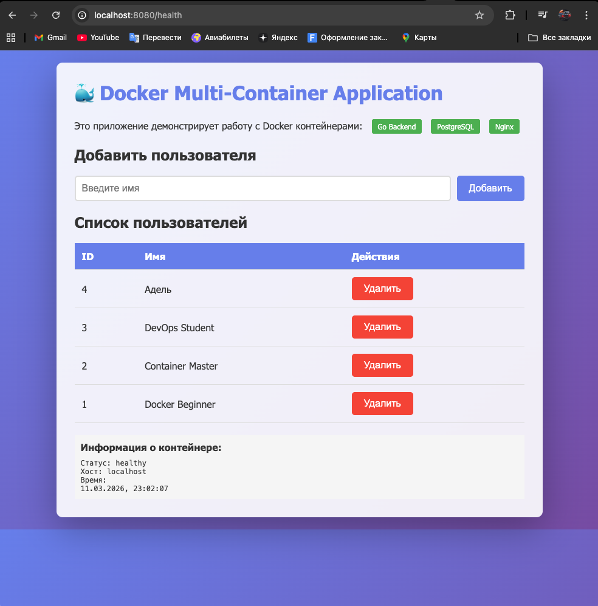

#### 2.2 Список пользователей в БД

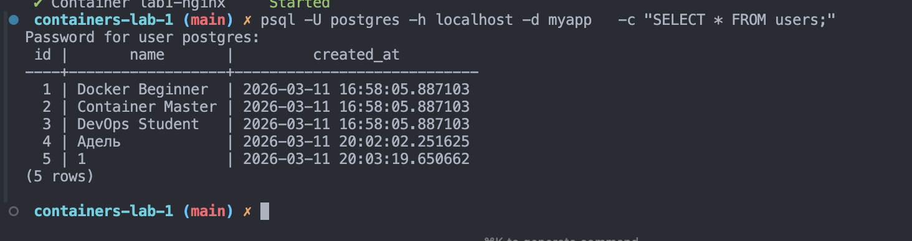

### 3. GitHub Actions

#### 3.1 Успешный запуск workflow

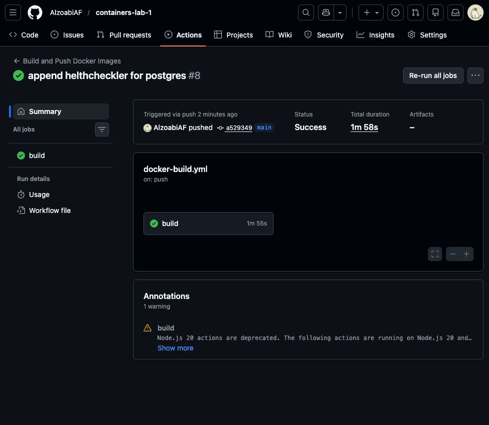

#### 3.2 Опубликованные образы в GHCR

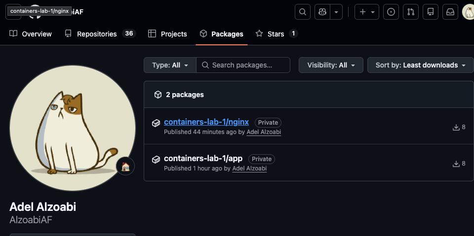

### 4. Выводы

